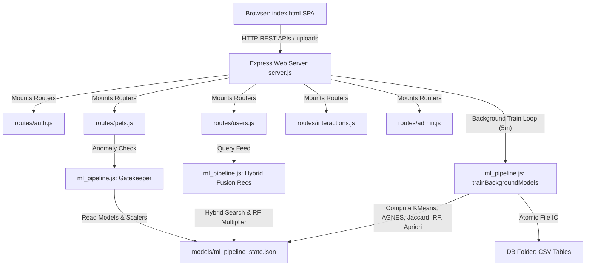

# Engineering & Mathematical Deep-Dive: The Best Buddy (BsBsBoby) System

Hey! Welcome to the comprehensive developer breakdown for **Best Buddy (BsBsBoby)**—our custom pet matchmaking and playdate recommendation platform. 

If you are onboarding onto the project, or just trying to figure out how our custom machine learning pipeline matches dogs with dogs and cats with cats, you're in the right place. We've built this entire engine from scratch in pure Node.js (no heavy Python frameworks or relational database overhead), using atomic file syncs and some beautiful multivariate math. 

Let's roll up our sleeves and walk through how this system actually works under the hood.

---

## 1. System Architecture: How It Fits Together

We've designed Best Buddy as a lightweight, snappy Single-Page Application (SPA) that talks to an Express backend. Instead of relying on a bulky database like PostgreSQL or MongoDB, we use a simple, zero-dependency CSV-based file storage system. 

Here is the high-level data flow mapping out how the browser, our Express routers, the background trainer, and the ML pipeline interact:



### Breaking Down Our Core Layers:
1. **The SPA Frontend (`index.html`)**: We styled this with a bold, retro Neo-Brutalist design (thick borders, offset drop shadows, bright pastels). It uses a clean display-toggle view switcher so the user never has to wait for full page reloads, and hooks up **Chart.js** to map out our ML clusters and behavioral trees in real-time.
2. **The Backend Web Server (`server.js`)**: This is the host monolith. It configures the global Express application, mounts our modular router controllers, serves up avatar media, and spins up our background training interval (which rebuilds all models every 5 minutes).
3. **Modular Route Controllers (`routes/`)**: To keep the code clean and maintainable, we separated route handlers into logical resource folders:
   - `auth.js`: Handles profile signups and uses bcrypt (10 rounds) to hash user passwords safely.
   - `users.js`: Manages profile updates and handles playdate feed queries.
   - `pets.js`: Registers pets and pipes them through Z-score scaling and the anomaly gatekeeper.
   - `interactions.js`: Logs swipes (likes and skips) with Unix timestamps.
   - `messages.js` & `chats.js`: Fetches mutual matches and handles direct message logs.
   - `admin.js`: Exposes active model states to the admin panel for human-in-the-loop overrides.
4. **Custom Machine Learning Core (`ml_pipeline.js`)**: This is where the magic happens. It runs our background models (K-Means, Kneedle elbow selection, AGNES trees, Apriori association mining, and a late-stage Random Forest classifier) to generate the final recommendation feed.

---

## 2. Our File-Based Database & Atomic State Saving

Let's look at the database. It lives in the `DB/` folder as a set of simple, readable CSV files:
- `users.csv`: Basic registration profiles, emails, hashes, and matching settings.
- `individual_pets.csv`: Physical stats, behavioral personality flags, and security status.
- `interactions.csv`: Historical log of swiping transactions (likes vs. skips).
- `messages.csv`: Map of unlocked mutual connections.
- `chat.csv`: Chat history logs exchanged between matching playdate profiles.
- `suspicious_profiles.csv`: A quarantine buffer holding anomalous records flagged by the Gatekeeper.

### The Atomic Sync Trick (How We Avoid File Corruption):
When you're saving model weights or writing to CSV tables in a file-based system, a sudden crash or power outage during a write operation is a disaster. If you call standard `writeFileSync`, Node.js will instantly truncate your target file to zero bytes and begin writing data. If the server crashes mid-write, your state file is ruined, and the server will crash on reboot because it can't parse the broken JSON.

To solve this, we implemented an atomic **Write-and-Rename** pattern:
```javascript
// ml_pipeline.js
fs.writeFileSync(STATE_FILE_TEMP, JSON.stringify(state), 'utf8');
fs.renameSync(STATE_FILE_TEMP, STATE_FILE);
```

#### Why this is a lifesaver:
Writing to a temporary file (`STATE_FILE_TEMP`) first ensures that the entire serialization process completes successfully before we touch our active data. The subsequent `renameSync` is a single atomic OS-level operation (POSIX `rename` or Windows `MoveFileEx`). The OS swaps the folder's directory pointers instantly without truncating the active file, guaranteeing transaction-like isolation and zero risk of corruption!

---

## 3. Deep Dive into the Custom Machine Learning Pipeline

Our ML pipeline combines multiple specialized layers. Instead of relying on a single model, we use a hybrid pipeline that integrates unsupervised physical clustering, hierarchical personality trees, social collaborative filtering, real-time trend mining, and late-stage ensemble validation.

Here is the computational path for data preprocessing, outlier gatekeeping, model clustering, and hybrid feed assembly:

```
+---------------------------------------------------------------------------------+
|                                PREPROCESSING                                    |
|  - Clones incoming data structures to prevent memory side-effects.             |
|  - Applies Z-Score Normalisation to scale weight, length, and age variables.    |
+------------------------------------+--------------------------------------------+
                                     |
                                     v
+---------------------------------------------------------------------------------+
|                          SECURITY GATEKEEPER & ANOMALY                          |
|  - Calculates squared Mahalanobis Distance (D^2) using inverse covariance.     |
|  - Blocks outliers exceeding Chi-Square threshold of 11.34 (e.g., 50kg cat!).   |
+------------------------------------+--------------------------------------------+
                                     |
                                     v
+---------------------------------------------------------------------------------+
|                         DYNAMIC PHYSICAL CLUSTERING                             |
|  - Computes WCSS for each K to locate the ideal elbow point.                   |
|  - Uses Kneedle algorithm to dynamically locate optimal K.                      |
|  - Groups physical vectors into clusters using unsupervised K-Means.            |
+------------------------------------+--------------------------------------------+
                                     |
                                     v
+---------------------------------------------------------------------------------+
|                            BEHAVIORAL CLUSTERING                                |
|  - Measures Hamming Distance across 5 personality traits.                       |
|  - Builds AGNES hierarchical dendrogram complete-linkage tree.                  |
|  - Cuts hierarchy at optimal height using the maximum gap difference.           |
+------------------------------------+--------------------------------------------+
                                     |
                                     v
+---------------------------------------------------------------------------------+
|                           COLLABORATIVE FILTERING                               |
|  - Maps an Inverted Overlap Index (items -> users who liked/skipped them).       |
|  - Computes Jaccard coefficients to discover similar swiping users.             |
+------------------------------------+--------------------------------------------+
                                     |
                                     v
+---------------------------------------------------------------------------------+
|                                TREND ANALYSIS                                   |
|  - Clusters likes into 1-hour session windows.                                  |
|  - Generates frequent itemsets and maps symmetrical lift association rules.     |
+------------------------------------+--------------------------------------------+
                                     |
                                     v
+---------------------------------------------------------------------------------+
|                               RECOMMENDATION FEED                               |
|  - Fuses Physical (35%), Collaborative (30%), Behavior (20%), and Apriori (15%) |
|  - Evaluates difference vectors with a late-stage Random Forest classifier.     |
|  - Applies species-lock and opposite-gender hard filters.                       |
+---------------------------------------------------------------------------------+
```

---

### A. Preprocessing & Z-Score Normalisation
We register physical parameters—Weight (kg), Length (cm), and Age (years)—which have completely different numerical scales. If we compared these directly:
- An absolute weight difference of 10kg would have $100\times$ more influence on Euclidean calculations than an age difference of 1 year, even though a 1-year age difference is highly significant in playdates.
To keep the scale balanced, we calculate Z-Score Normalisation statistics for the entire database:

$$\mu_j = \frac{1}{N} \sum_{i=1}^{N} x_{i, j}, \quad \sigma_j = \sqrt{\frac{1}{N-1} \sum_{i=1}^{N} (x_{i, j} - \mu_j)^2}$$

Using these means and deviations, we scale our physical features into standard Z-scores:

$$z_j = \frac{x_j - \mu_j}{\sigma_j}$$

*Senior Tip*: Notice we use **Bessel's Correction** (dividing by $N-1$ instead of $N$) in our standard deviation formula. This ensures our variance estimates are completely unbiased, even when the registry is small during cold-starts.

---

### B. The Kneedle Algorithm: Dynamic Elbow Point Selection
We want our K-Means physical clusters to scale dynamically as new pets register. To avoid hardcoding a fixed number of clusters ($K$), the training worker automatically detects the optimal "elbow" on the WCSS curve:

1. We run K-Means for $K \in [1, \text{maxK}]$ and calculate WCSS for each step:

   $$\text{WCSS}_K = \sum_{k=1}^{K} \sum_{z_i \in C_k} \|z_i - \mu_k\|^2$$

2. We normalize the WCSS values and the $K$ indices between $0$ and $1$ to map them onto a unit square.
3. We establish a straight line chord connecting the starting point $(0, \text{normWCSS}_0)$ and the ending point $(1, \text{normWCSS}_{\text{limit}-1})$ using the general linear form $Ax + By + C = 0$:

   $$A = \text{normWCSS}_{\text{limit}-1} - \text{normWCSS}_0$$

   $$B = \text{normK}_0 - \text{normK}_{\text{limit}-1}$$

   $$C = \text{normK}_{\text{limit}-1} \cdot \text{normWCSS}_0 - \text{normK}_0 \cdot \text{normWCSS}_{\text{limit}-1}$$

4. We calculate the perpendicular distance from each normalized curve coordinate $P_i(x_i, y_i)$ to this line:

   $$d_i = \frac{|A x_i + B y_i + C|}{\sqrt{A^2 + B^2}}$$

5. The optimal $K$ is selected as the index maximizing $d_i$ (the point of maximum curve deceleration / elbow point).

---

### C. Outlier Filtering & Covariance Inversion (The Security Gatekeeper)
Standard Euclidean distance metrics assume physical features are completely independent. However, weight and length in animals are highly correlated (longer animals naturally weigh more). If we only used Euclidean distance to flag outliers, it would miss correlated anomalies—like a very short cat that weighs 35kg.

Our Gatekeeper uses the **Mahalanobis Distance**, which factors in these correlations using the cluster covariance matrix $\Sigma$:

1. For each cluster, we calculate the $3 \times 3$ covariance matrix $\Sigma$:

   $$\Sigma = \frac{1}{|C_k|-1} \sum_{z_i \in C_k} (z_i - \mu_k)(z_i - \mu_k)^T$$

2. We add a tiny Ridge penalty ($\epsilon = 10^{-4}$) to the diagonal to ensure the matrix is stable and non-singular:

   $$\Sigma_{\text{reg}} = \Sigma + \epsilon \cdot I$$

3. Instead of running a heavy Gauss-Jordan elimination on Node's main event loop, we calculate the inverse covariance matrix $\Sigma_{\text{reg}}^{-1}$ analytically using a highly optimized 3x3 determinant expansion (Sarrus' Rule):

   $$\Sigma_{\text{reg}}^{-1} = \frac{1}{\text{det}(\Sigma_{\text{reg}})} \text{adj}(\Sigma_{\text{reg}})$$

4. When a new pet is added, it is Z-score scaled and assigned to its closest cluster. We then calculate the squared **Mahalanobis Distance** ($D^2$):

   $$D^2 = (z - \mu_k)^T \Sigma_{\text{reg}}^{-1} (z - \mu_k)$$

5. We evaluate this against a strict Chi-Square ($\chi^2$) boundary of **11.34** (3 degrees of freedom at a 99% confidence level). If $D^2 > 11.34$, the profile is flagged as a physical anomaly and moved to the admin audit quarantine buffer.

---

### D. AGNES Hierarchical Personality Archetypes
For behavioral matchmaking, pets are categorized into personality archetypes using complete-linkage Agglomerative Nesting (AGNES):

1. Pets are mapped to a 5-D binary trait vector representing `['active', 'friendly', 'calm', 'touchy', 'sleepy']`.
2. The initial distance matrix is computed using **Hamming Distance** (mismatch sum):

   $$d_{\text{Hamming}}(v_1, v_2) = \sum_{d=1}^{5} \mathbb{I}(v_{1, d} \neq v_{2, d})$$

3. AGNES builds a complete binary tree hierarchy.
4. To dynamically slice the tree into behavioral classes, we traverse the tree recursively, measuring the vertical height differences (gaps) between parent and child nodes.
5. We slice the hierarchy at the cut height yielding the **largest gap**, dynamically clustering pets into distinct behavioral archetypes (`globalAgnesMap`).

---

### E. Jaccard Collaborative Filtering
We want similar swiping histories to fuel recommendations. However, comparing every pair of users is computationally heavy ($O(U^2)$). As our user base grows, this would slow down the system.

To keep lookups fast, we built an **Inverted User-Pet Index**:
* `itemLikers[petUsername]`: Set of users who liked this pet.
* `itemSkippers[petUsername]`: Set of users who skipped this pet.

For the current user $u_1$, candidate target users $u_2$ are populated *only* if they share at least one overlapping liked or skipped pet in our inverted index. The Jaccard coefficient measures their similarity:

$$J(u_1, u_2) = \frac{|U_1 \cap U_2|}{|U_1 \cup U_2|}$$

Where $U_i$ represents the swiped sets. Similarity values below `0.1` are pruned, and the output is cached in `globalUserSimMatrix`.

---

### F. Apriori Trend Mining (Session-Based Session Rules)
We also want to pick up on temporal trends in a user's swiping sessions. For example, if a user starts swiping and liking active, young Golden Retrievers in a session, the recommendation feed should adapt in real-time.

1. We group liked pet attributes into transactions based on 1-hour session windows:

   $$\text{Session Window} = \left\lfloor \frac{\text{Timestamp}}{3.6 \times 10^6 \text{ ms}} \right\rfloor$$

2. We run the `node-apriori` mining engine to find frequent co-occurrence rules.
3. For pairs $\{A, B\}$, we compute the true Lift index:

   $$\text{Lift}(A \implies B) = \frac{\text{Support}(A \cup B)}{\text{Support}(A) \cdot \text{Support}(B)}$$

4. High-lift rules ($\text{Lift} > 1.2$) are cached to boost matching candidate scores when similar attributes are liked in sequence during a session.

---

### G. The Late-Stage Random Forest Ranker
When a user logs more than 20 swipes, we train a custom Random Forest Classifier (50 estimators, max 3 random features) to refine recommendations:

1. **Balanced Downsampling**: Since users typically skip more profiles than they like, the training set is downsampled to match the size of the minority class (Likes vs. Skips 1:1 ratio) via a Fisher-Yates shuffle. This prevents the forest from being biased towards the majority class.
2. **Feature Vector**: Built using the differences between the current user's pet and the target pet:

   $$\text{Feature Vector} = \left[ |w_{u} - w_{t}|, |l_{u} - l_{t}|, |a_{u} - a_{t}|, \text{SameBreedFlag}, \frac{\text{BehavioralOverlap}}{5} \right]$$

3. **Validation**: We train the forest on an 80% split and evaluate it on a 20% validation split. The forest is retained *only* if the validation accuracy is $\ge 70\%$.
4. **Prediction Multiplier**: During feed scoring, the forest predicts a swipe likelihood probability $P(\text{Like})$ by averaging positive tree votes:

   $$P(\text{Like}) = \frac{1}{M} \sum_{m=1}^{M} \text{Tree}_m(\text{Feature Vector})$$

   This probability is mapped to a prediction multiplier scaling the candidate's final score:

   $$\text{Multiplier} = 0.8 + (P(\text{Like}) \cdot 0.4)$$

---

### H. The Hybrid Fusion Score Formula
When a user requests their recommendation feed, all the machine learning outputs are combined:

$$\text{FusionScore} = (S_{\text{phys}} \cdot W_{\text{phys}}) + (S_{\text{beh}} \cdot W_{\text{beh}}) + (S_{\text{cf}} \cdot W_{\text{cf}}) + (S_{\text{apriori}} \cdot W_{\text{apriori}})$$

Where:
- **Weights ($W$)**: Physical (35%), Collaborative Filtering (30%), Behavioral (20%), and Apriori (15%).
- **Physical Score ($S_{\text{phys}})**: Computed using the Euclidean distance of standardized physical features:

  $$S_{\text{phys}} = e^{-0.5 \cdot \|z_u - z_c\|}$$

- **Collaborative Filtering ($S_{\text{cf}}$)**: Calculated by aggregating similarities of users who liked/skipped candidate $c$:

  $$S_{\text{cf}} = \text{clamp}\left( 0, 1, \frac{\bar{s} + 1}{2} \right), \quad \text{where } \bar{s} = \frac{\sum_{i \in \text{Likers}} J(u, i) - \sum_{j \in \text{Skippers}} J(u, j)}{|\text{Likers}| + |\text{Skippers}|}$$

- **Behavioral Score ($S_{\text{beh}}$)**: Evaluated as $1.0$ if the candidate shares the user's preferred behavioral archetype, otherwise defaulting to the normalized Hamming trait overlap ($[0.0, 1.0]$).
- **Apriori Score ($S_{\text{apriori}}$)**: Mapped using active lift coefficients:

  $$S_{\text{apriori}} = \min\left(1.0, \frac{\text{Lift}_{\max} - 1.0}{2.0}\right)$$

Finally, a **Hard Filter** is applied to ensure safety and compatibility:
- **Rule 1 (Species Lock)**: Only pets of the same species are matched:

  $$\text{Species}_u \equiv \text{Species}_c$$

- **Rule 2 (Opposite Gender Lock)**: Only pets of opposite genders are matched:

  $$\text{Gender}_u \neq \text{Gender}_c$$

The filtered list is sorted, scaled by the Random Forest multiplier, and returned to the UI.

---

## 4. Backend Routing & Controllers (`routes/`)

To keep the backend structured and modular, all resource routes are separated into dedicated router controllers:

1. **`auth.js`**
   - `/register`: Parses registration details, validates inputs (email syntax, phone numbers, locations), hashes passwords using `bcrypt` (10 rounds), and writes new records to `users.csv`.
   - `/login`: Verifies user credentials, reads the user's pet record, and returns a session token.
   - `/forgot-password`: Simulates a secure password-recovery workflow.
2. **`pets.js`**
   - `/`: Creates or updates a pet's profile. Runs Z-score scaling and calls `gatekeeper(pet)`.
     - If safe: assigns cluster ID via `assignToCluster(pet)` and writes to `individual_pets.csv`.
     - If flagged: writes profile to `suspicious_profiles.csv` for admin review.
3. **`users.js`**
   - `/:username`: Updates user contact information.
   - `/:username/playdates`: Fetches the hybrid recommendation feed for the user's pet.
4. **`interactions.js`**
   - `/`: Logs likes and skips in `interactions.csv`. If a mutual "like" occurs, it appends a matching node to `messages.csv`.
5. **`messages.js`**
   - `/`: Fetches mutual matches. If both users like each other, they are unlocked for direct messaging.
6. **`chats.js`**
   - Retrieves and inserts chat logs into `chat.csv` for mutual matches.
7. **`breeds.js`**
   - Serves cats and dogs datasets dynamically to fuel the frontend's autocomplete fields.
8. **`admin.js`**
   - `/dashboard`: Serves data for K-Means centroids, AGNES tree structures, and Apriori association rules.
   - `/pets/:username/accept` & `/pets/:username/refuse`: Updates flagged profiles. Accepted profiles are added to K-Means clusters; refused profiles are deleted.

---

## 5. Frontend Single Page Application (`index.html`)

Our frontend is a Single-Page Application (SPA) designed with a clean, high-impact **Neo-Brutalist** aesthetic.

### A. Neo-Brutalist Styling Tokens:
- **Bold Borders**: Thick black borders (`5px solid #000`) for containers and inputs.
- **Sharp Box Shadows**: Offset shadows (`box-shadow: 6px 6px 0px #000`) giving buttons a retro-pop, tactile aesthetic.
- **Vibrant Color Palette**: Bright pastel HSL values:
  - `--pink: #f564a9`
  - `--bg: #f9ede3` (warm cream)
  - `--yellow: #f8c146`
  - `--blue: #4fc3f7`

### B. View Orchestration
Views are managed efficiently by toggling the `display` properties of screen container sections:
```javascript
function showScreen(screenId) {
    document.querySelectorAll('.screen').forEach(el => el.classList.remove('active'));
    document.getElementById(screenId).classList.add('active');
}
```
This approach avoids standard multi-page redirects, maintaining quick transitions and a smooth user experience.

### C. Admin Visualizations
The administrative dashboard uses **Chart.js** to render complex mathematical relationships:
- **K-Means Scatter Plot**: Projects physical clusters in real-time, plotting weight vs. age.
- **AGNES Dendrogram Tree**: Visualizes behavioral complete-linkage trees using hierarchically ordered step charts.
- **Apriori Rules Map**: Plots lift coefficients against support to visualize association rules.
- **Relative Feature Radar**: Evaluates a searched pet's dimensions (age, weight, length, active, friendly, calm, touchy, sleepy) against system averages on a unified radar chart.

---

## 6. Architectural Strengths & Performance Highlights

1. **Lightweight & Modular**: Relies on lightweight JS libraries (`ml-kmeans`, `ml-hclust`, `ml-random-forest`) to run complex machine learning tasks directly inside a Node.js runtime, keeping memory overhead minimal.
2. **Zero-Dependency DB**: Leverages simple CSV tables for persistence. This makes the system incredibly portable and easy to run, while atomic temp-swaps protect against data corruption.
3. **Optimized Collaborative Filtering**: Uses an inverted user-pet index to scale Jaccard similarity lookups. This prevents slow $O(U^2)$ pairwise comparisons, keeping feed generation fast as the user base grows.
4. **Security Gatekeeper**: Outlier detection using the Mahalanobis Distance checks correlations between physical dimensions. This automatically flags fake profiles (e.g., joke accounts or spam) before they can skew K-Means centroids or compromise recommendation quality.
5. **Dynamic Hybrid Personalisation**: Combines physical features, collaborative filtering, behavior archetypes, and association rules into a single scored feed, topped off by a Random Forest late-stage multiplier to deliver highly personalized matching.

---

## 7. Algorithmic Mechanics & Functional Utility

This section provides a clear mapping of the core algorithms in our custom pipeline, detailing exactly **how they work** and **why they are there** from a computational and functional standpoint.

### 1. Z-Score Physical Normalisation (Preprocessing)
* **How it Works**: Standardises physical vector components (Weight, Length, Age) by subtracting their corresponding global sample means and dividing by their sample standard deviations (using Bessel's correction $N-1$ for unbiased sample variance estimation).
* **Why it is There**: It eliminates numerical scale dominance. Attributes like Weight in kg have numerical values that vary across a wider scale compared to Age in years. Without scaling, weight differences would dominate physical Euclidean distance checks; scaling keeps all features equally significant.

### 2. Unsupervised K-Means Physical Clustering
* **How it Works**: Iteratively partitions physical data features into $K$ spatial cluster cohorts, utilizing `kmeans++` centroid seeding distributions to avoid suboptimal local minima, and minimizing the Within-Cluster Sum of Squares (WCSS).
* **Why it is There**: It establishes physical size-and-age categories. Grouping pets into physical cohorts (e.g. young/small, middle-aged/medium, senior/large) creates a robust baseline compatibility standard that prevents mismatched pairings (e.g., matching a miniature young dog with an extremely large senior dog).

### 3. Automated Kneedle Elbow Selection (Dynamic K)
* **How it Works**: Evaluates KMeans configurations across a range of $K$ values (1 to 10), normalizes the resulting WCSS curve onto a 0-1 unit square, and selects the $K$ that maximizes the perpendicular distance to the straight line chord connecting the starting and ending WCSS coordinates.
* **Why it is There**: It removes the need for manual hyperparameter configuration. As the user base and pet registry expand naturally, hardcoded cluster caps ($K$) would lead to poor groupings. Automating elbow detection allows the system to adjust cluster counts dynamically.

### 4. Mahalanobis Distance & Chi-Square Outlier Detection (Gatekeeper)
* **How it Works**: Calculates the distance from a profile's Z-Score scaled physical coordinates to its assigned cluster center, scaling the coordinate offsets by the cluster's inverse covariance matrix. If the resulting squared distance ($D^2$) exceeds the Chi-Square 99% confidence threshold boundary of 11.34, it flags the profile as an outlier.
* **Why it is There**: It serves as a secure outlier gatekeeper. Standard Euclidean distances only define spherical boundaries and miss mismatched correlations (e.g., a cat that weighs 35kg but is short is highly abnormal). Mahalanobis flags these spam or joke profiles automatically to protect the training clusters from pollution.

### 5. AGNES Complete-Linkage Personality Clustering
* **How it Works**: Constructs hierarchical complete-linkage agglomerations based on a trait Hamming distance matrix calculated from 5-D binary personality vectors. It traverses the dendrogram tree recursively to locate the split height yielding the largest vertical node gap.
* **Why it is There**: It establishes distinct personality cohorts. Grouping diverse, granular traits into structured archetypes (e.g., calm-gentle vs. active-rambunctious) allows the playdate search engine to recommend matching behavioral play styles.

### 6. User-User Jaccard Collaborative Filtering
* **How it Works**: Resolves pairwise swipe similarities using Jaccard coefficients (evaluating the intersection of liked/skipped targets divided by the union of swiped histories). This is scaled by an inverted index mapping pets to swiping users to avoid slow $O(U^2)$ matrix evaluations.
* **Why it is There**: It powers behavioral recommendations. Sharing user swiping preferences (likes and skips) allows the feed scoring engine to identify similar profiles and suggest candidates that similar users have already liked.

### 7. Apriori Association Trend Mining (Session-Based Rules)
* **How it Works**: Organizes liked pet features into transactional sets based on 1-hour active user sessions. It counts item occurrences to evaluate support and filters frequent itemsets of size 2. High-lift rules ($\text{Lift} > 1.2$) are mapped into a symmetrical rules index.
* **Why it is There**: It tracks real-time, session-based swiping trends. If a user is actively swiping on active, young Golden Retrievers in a session, the Apriori rules index identifies this trend and immediately prioritizes candidates matching these rules in the recommendation feed.

### 8. Random Forest Late-Stage Adjuster (Consensus Multiplier)
* **How it Works**: Extracts difference vectors (physical offsets, breed matches, behavioral overlaps) from swipe history. It downsamples the majority swipe action to match the minority class 1:1, trains an ensemble of 50 decision trees on an 80/20 split, and multiplies recommendation scores by the positive vote probability.
* **Why it is There**: It serves as a late-stage validation ranking layer. Simple physical and collaborative filtering scores only provide general proximity matching; the Random Forest learns fine-grained multi-feature offsets to adjust final scores based on actual swiping patterns.
